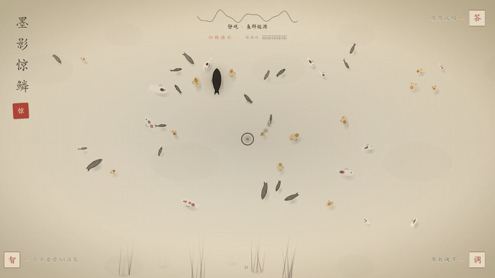
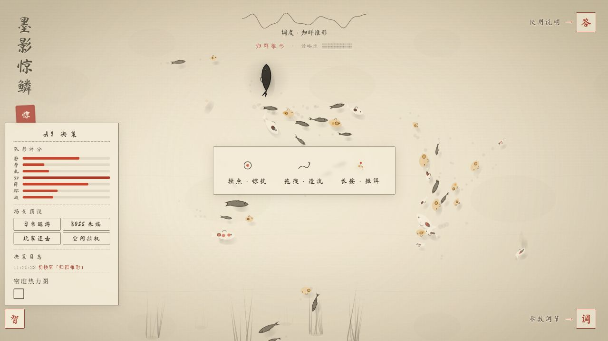
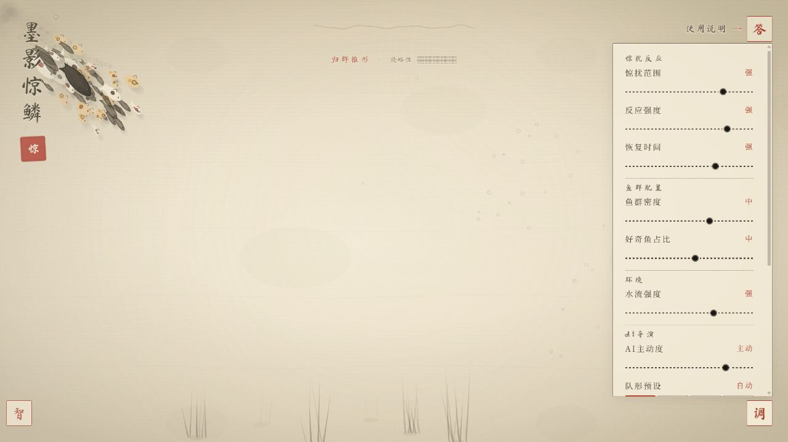
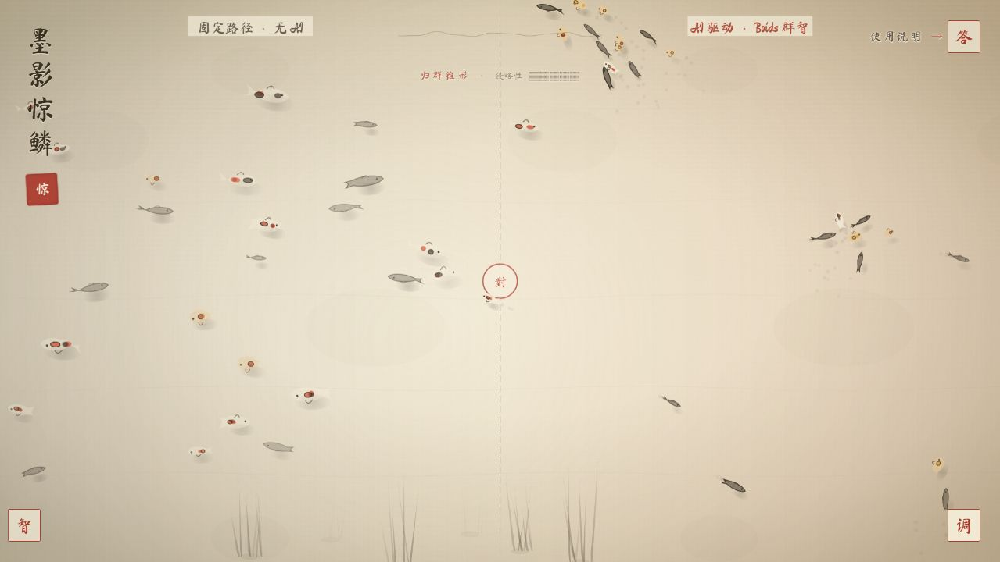
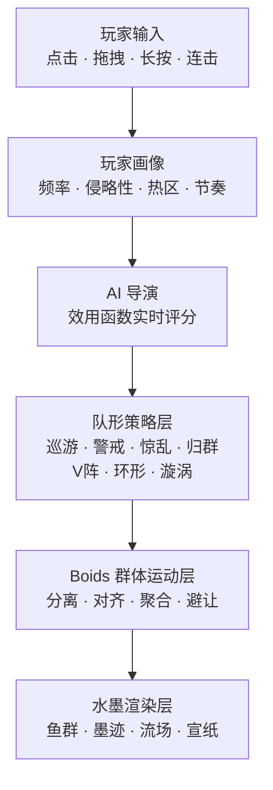

<div align="center">

# 墨影惊鳞

### 水墨美学 × 群体智能 × AI 鱼群导演

**上海波克 Vibe Jam AI 游戏开发比赛初赛作品 · 已成功入围决赛**

[](https://yu.mixi.qzz.io/)


[](https://yu.mixi.qzz.io/)

**[▶ 立即进入在线版](https://yu.mixi.qzz.io/)**

</div>

> “墨”为视觉基调，“影”喻 AI 隐形调度，“惊”是玩家与鱼群的核心交互，“鳞”则代表水中万千游鱼。

## 作品简介

传统捕鱼游戏里的小型鱼种常沿固定路径、匀速游过，整齐却缺少生命力。《墨影惊鳞》尝试让每条鱼成为会观察邻居、感知玩家、产生个体反应的“活物”：底层由 **Boids 群体算法**生成自然涌现的聚散与转向，中层提供 **7 种鱼群队形**，顶层由 **AI 导演**根据玩家的点击频率、侵略性与热区实时选择策略。

作品以宣纸、墨痕与朱印构建视觉语言。鱼群聚拢时墨色渐浓，受惊散开时墨色变淡，游动轨迹如墨滴入水，在算法和东方美学之间取得平衡。

## 核心亮点

| 模块 | 设计 |
| :-- | :-- |
| **AI 鱼群导演** | 通过效用函数为各队形实时评分，在巡游、警戒、惊乱、归群、V 阵、环形和漩涡之间动态调度 |
| **四种鱼类性格** | 锦鲤反应迟缓、墨鱼瞬间炸开、金鱼好奇靠近、影鱼带队冲锋；每类鱼拥有独立行为参数 |
| **四类水面交互** | 轻点惊扰、拖拽造流、长按撒饵、连点惊浪，均会改变附近鱼群的速度与轨迹 |
| **玩家节奏学习** | 记录点击频率、力度和热区，形成侵略性画像，并在空闲时回放玩家节奏 |
| **决策可视化** | 实时展示队形评分、AI 意图和带时间戳的决策日志，让“为什么这样游”清晰可见 |
| **一键对比模式** | 同屏比较传统固定路径与 AI 驱动鱼群，直观呈现动态策略带来的差异 |
| **完整参数面板** | 可调整惊扰范围、反应强度、恢复时间、鱼群密度、水流强度、AI 主动度与队形预设 |

## 玩法操作

| 操作 | 鱼群反应 |
| :--: | :-- |
| **轻点水面** | 点击附近的鱼受惊散开，随后逐渐恢复队形 |
| **按住拖拽** | 在水中制造流场，鱼群会顺着玩家的笔势游动 |
| **长按水面** | 撒下饵料，好奇的鱼会率先靠近 |
| **快速连点** | 激起强烈惊浪，触发更大范围的群体响应 |

页面角落的「**智**」「**调**」「**答**」分别对应 AI 决策、参数调节和作品说明面板。

## 游戏截图

<table>
  <tr>
    <td width="50%"></td>
    <td width="50%"></td>
  </tr>
  <tr>
    <td align="center"><b>AI 导演 · 实时评分与场景预设</b></td>
    <td align="center"><b>参数面板 · 精细调节鱼群行为</b></td>
  </tr>
</table>

<p align="center">
  
  <br>
  <b>对比模式 · 左侧固定路径，右侧 AI 驱动</b>
</p>

## 系统架构



AI 不直接操控每一条鱼，而是站在更高层决定“此刻应该采用哪一种群体策略”；具体的局部运动仍由鱼的个体规则自然涌现。这种分层方式兼顾了可控性、自然感与实时性能。

## 技术实现

- 原生 **HTML / CSS / JavaScript**，无需构建工具或第三方游戏引擎
- **Canvas 2D** 实时绘制鱼群、水草、墨迹、气泡、流场与交互反馈
- Boids 分离 / 对齐 / 聚合规则与空间哈希邻域查询
- 效用 AI、队形状态机、行为画像和点击热力图
- 鼠标与触屏双端交互，适配不同窗口尺寸
- 单文件游戏主体，便于比赛评审直接打开体验

## 本地运行

无需安装依赖，直接用浏览器打开 [`index.html`](./index.html) 即可。

也可以在项目目录启动任意静态文件服务器，例如：

```bash
python -m http.server 8080
```

随后访问 `http://localhost:8080`。

## 项目结构

```text
墨影惊鳞/
├── index.html                  # 可直接运行的游戏本体
├── assets/
│   ├── favicon.svg             # 朱印风格网页图标
│   └── screenshots/           # README 展示截图
├── docs/
│   ├── 作品说明.md             # 比赛作品说明
│   ├── Prompt对话日志.md       # AI 协作开发完整记录
│   └── 赛题要求.txt            # 原始赛题与提交要求
└── README.md
```

## AI 协作开发

项目从一次苏格拉底式对话开始：先从“为什么鱼看起来没有生命力”追问到行为目标，再逐步推演出 **AI 导演 + 队形策略 + Boids + 水墨美学** 的三层方案。AI 参与了核心算法生成、效用函数设计、鱼种差异化、交互方案和性能优化，也在迭代中提出了对比模式与决策可视化等展示策略。

完整过程可查看：

- [作品说明](./docs/作品说明.md)
- [Prompt 对话日志](./docs/Prompt对话日志.md)
- [赛题要求](./docs/赛题要求.txt)

## 比赛成绩

本作品作为上海波克 **Vibe Jam AI 游戏开发比赛**初赛参赛项目提交，最终成功通过初赛并入围决赛。

<div align="center">

如果你喜欢这个作品，欢迎点亮 ⭐ Star。

**[在线体验](https://yu.mixi.qzz.io/) · [查看源码](./index.html)**

</div>
